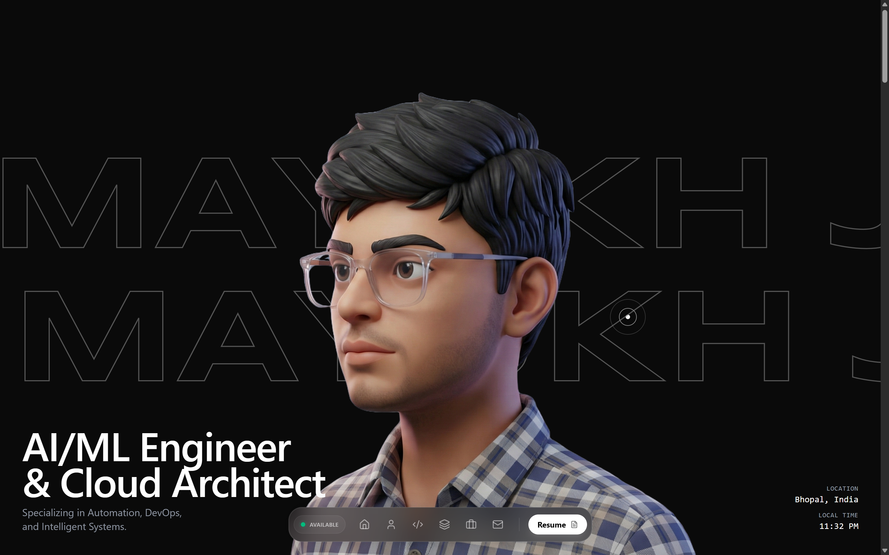
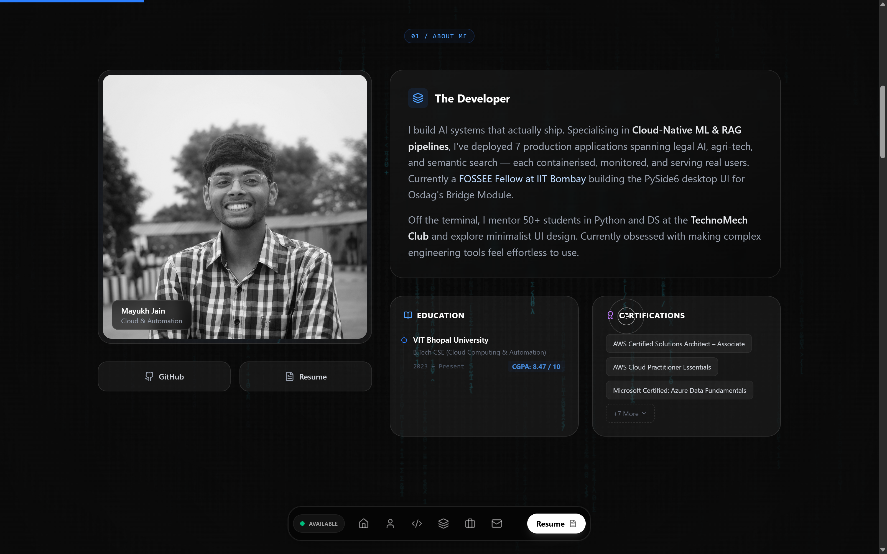
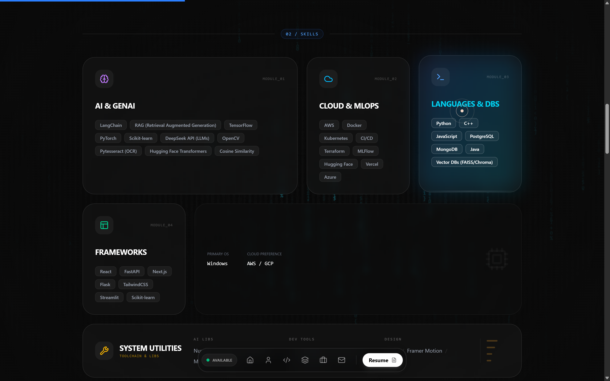
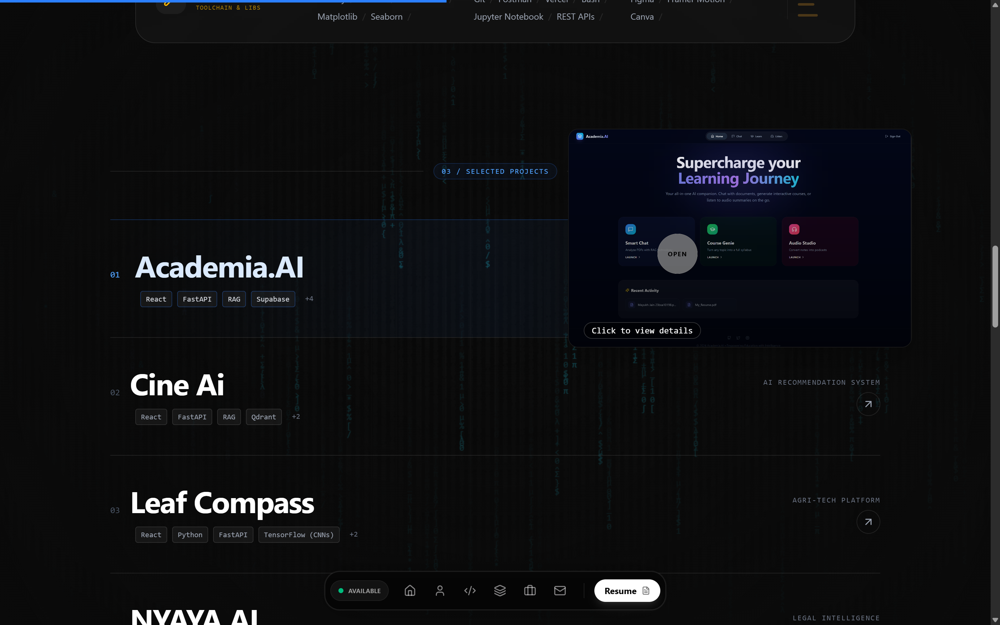
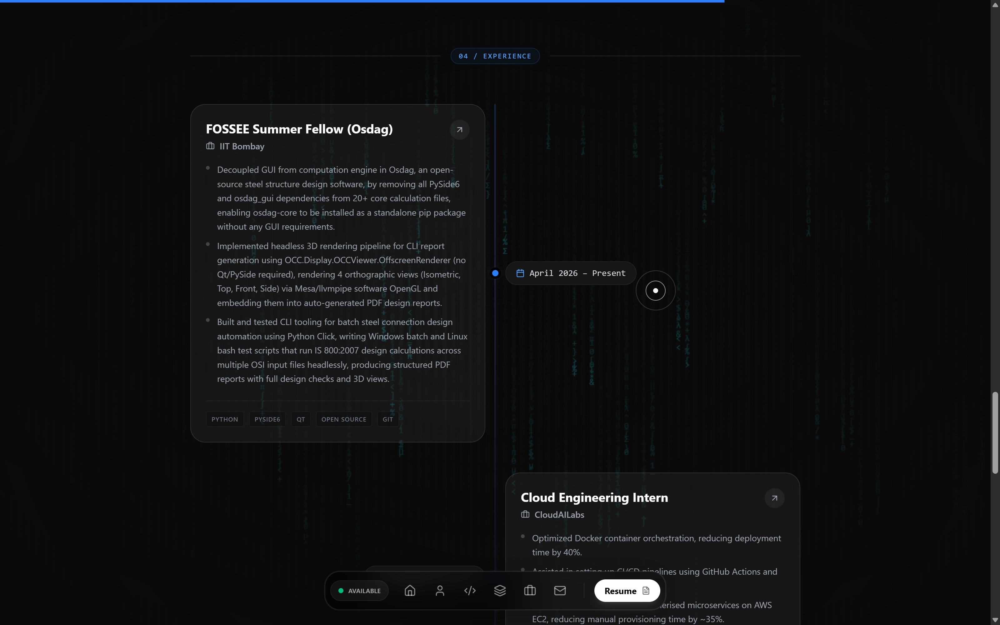
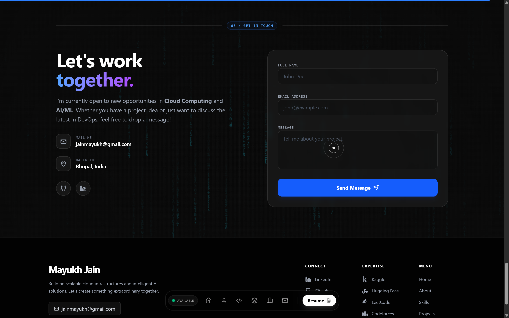

<div align="center">

# Mayukh Jain — Portfolio

**AI/ML Engineer & Cloud Architect**  
Building production-grade AI systems with RAG, LLMs, MLOps, and cloud-native deployment.

[](https://mayukhjain.vercel.app)
[](https://mayukhjain.vercel.app/#about)
[](https://mayukhjain.vercel.app/#skills)
[](https://mayukhjain.vercel.app/#work)
[](https://mayukhjain.vercel.app/#experience)
[](https://mayukhjain.vercel.app/#contact)

</div>

---

## Overview

A high-performance personal portfolio site built with React, showcasing projects, experience, and technical skills in AI/ML engineering and cloud architecture. Features smooth Framer Motion animations, a glassmorphism-inspired UI, and a fully responsive layout.

---

## Features

- **Linear-style animations** — page transitions and scroll-triggered reveals powered by Framer Motion
- **Glassmorphism UI** — frosted-glass cards with backdrop blur and layered depth
- **Fully responsive** — optimised for mobile, tablet, and desktop viewports
- **Sections** — Hero, About, Skills, Projects, Experience, and Contact
- **Resume download** — one-click PDF download of current CV
- **Performance-focused** — lazy loading, code splitting, and Vite's production build pipeline

---

## Tech Stack

| Layer | Technology |
|---|---|
| Framework | React 18 |
| Styling | Tailwind CSS 3 |
| Animations | Framer Motion |
| Icons | Lucide React |
| Build tool | Vite |
| Deployment | Vercel |

---

## Project Structure

```
Portfolio/
├── my-portfolio/
│   ├── public/
│   │   └── favicon.ico
│   ├── src/
│   │   ├── components/       # Reusable UI components
│   │   ├── sections/         # Page sections (Hero, About, Projects, …)
│   │   ├── assets/           # Images, icons
│   │   ├── App.jsx
│   │   └── main.jsx
│   ├── index.html
│   ├── tailwind.config.js
│   ├── vite.config.js
│   └── package.json
├── MayukhJain.pdf            # Resume  
└── LICENSE        
```

---

## Getting Started

### Prerequisites

- Node.js ≥ 18
- npm or yarn

### Local development

```bash
# 1. Clone the repo
git clone https://github.com/Mayukh-Jain/Portfolio.git
cd Portfolio/my-portfolio

# 2. Install dependencies
npm install

# 3. Start dev server
npm run dev
```

The site will be available at `http://localhost:5173`.

### Build for production

```bash
npm run build       # outputs to my-portfolio/dist/
npm run preview     # preview the production build locally
```

---

## Deployment

The site is deployed via [Vercel](https://vercel.com). Every push to `main` triggers an automatic redeployment.

To deploy your own fork:

1. Fork this repository
2. Import the project into Vercel
3. Set the **root directory** to `my-portfolio`
4. Vercel auto-detects Vite — no extra configuration needed
5. Hit **Deploy**

---

## Customisation

All personal content (name, bio, project data, skills, social links) lives in the component/section files under `src/`. To adapt this portfolio for your own use:

1. Update personal details in the Hero and About sections
2. Replace project entries in the Projects section with your own work
3. Swap out `MayukhJain.pdf` at the repo root with your own resume
4. Update social links (GitHub, LinkedIn, email) in the Contact section
5. Replace the favicon in `public/`


---

## Contact

**Mayukh Jain**  
[mayukhjain.vercel.app](https://mayukhjain.vercel.app) · [LinkedIn](https://www.linkedin.com/in/mayukh-jain-b4732128a) · [GitHub](https://github.com/Mayukh-Jain)

---

## License

This project is licensed under the [MIT License](./LICENSE).

---

<div align="center">
  <sub>Built with React, Tailwind CSS, and Framer Motion · Deployed on Vercel</sub>
</div>